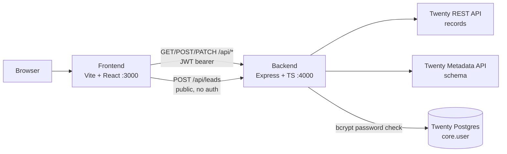
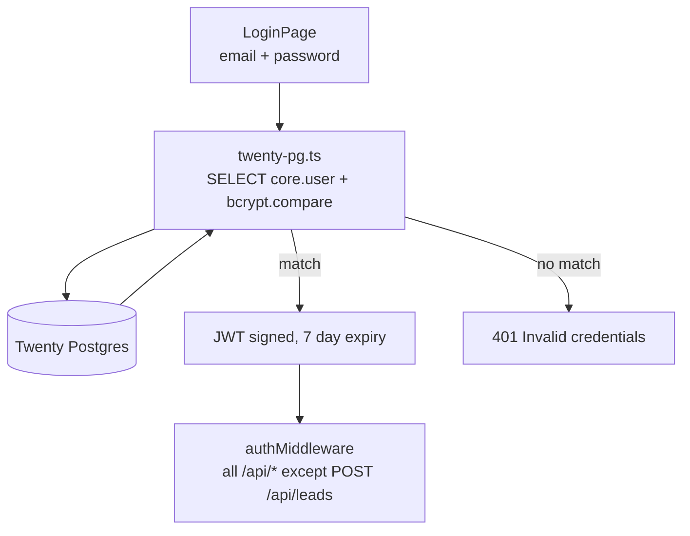
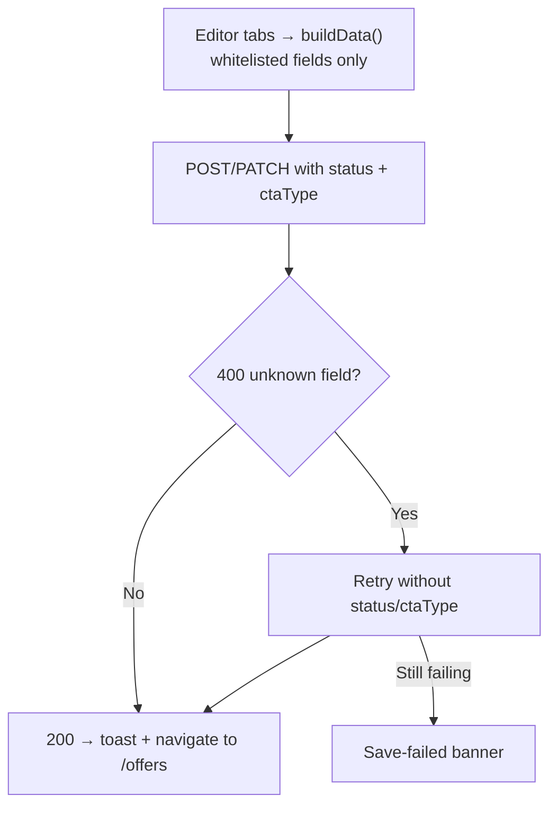
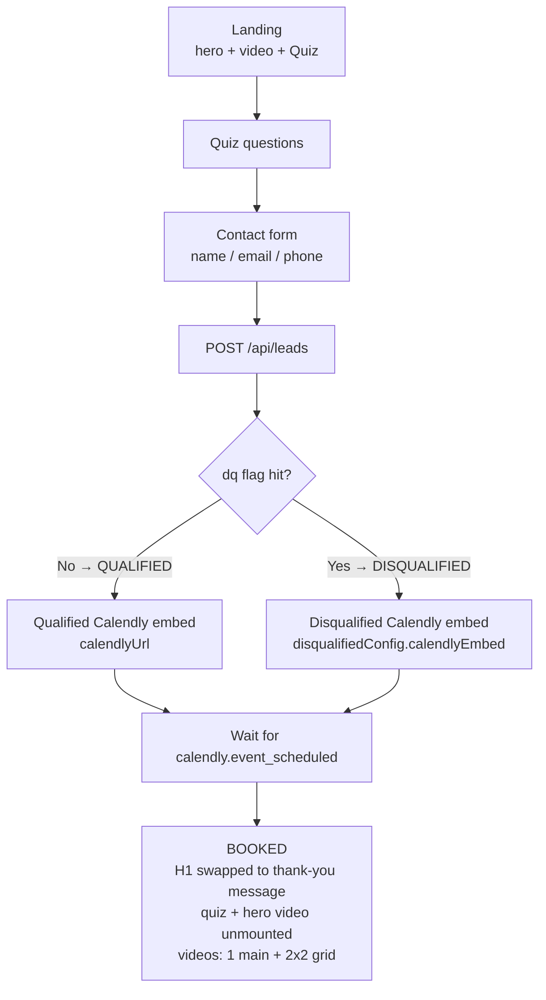

# Open Offer Builder

Offer-funnel builder backed by Twenty CRM. Each offer is a full funnel — landing hero + video + qualifier quiz → contact capture → Calendly booking → booked thank-you with videos — with a disqualified path for poor-fit prospects. Everything is authored in the Offer Detail editor and stored on the `agencyOffers` object in Twenty.

## Architecture

Three processes talk to each other. The browser only ever talks to the
frontend; the frontend talks to the backend over `/api/*`; the backend is the
only thing that touches Twenty (REST for records, Metadata API for schema,
Postgres for login verification).



How it works, end to end:

- **Authoring:** the Offer Detail editor (`OfferDetailPage.tsx`) holds one tab
  per concern (landing, thank-you, disqualified, settings, UTM, proposals).
  Saving whitelists fields and `POST`/`PATCH`es a single `agencyOffers`
  record — configs travel as `RAW_JSON`, embeds/links as `TEXT`/`LINKS`.
- **Serving:** the public preview (`PreviewPage.tsx`) fetches that one record
  and renders hero, video, and quiz from it. No CMS, no build step — editing
  the offer changes the funnel immediately.
- **Capture:** quiz answers + contact form `POST /api/leads` (the one public
  route), creating an `agencyLead` tagged `QUALIFIED`/`DISQUALIFIED`.
- **Booking:** the Calendly widget lives inside `Quiz.tsx`; its
  `event_scheduled` message flips the funnel into the booked state.

Auth follows the same split — the browser never sees Postgres:



Saving is defensive: Twenty rejects unknown fields with a 400, so the editor
tries the full payload first and retries without the not-yet-provisioned
fields (`status`/`ctaType`) rather than failing the whole save:



## How the funnel works



- **Qualified path** uses `thankYouConfig` + `calendlyUrl`.
- **Disqualified path** (any answer with the DQ flag checked — sticky for the session) uses `disqualifiedConfig` + its own Calendly embed. The lead is still captured, tagged `DISQUALIFIED`.
- **Booked state** persists in `localStorage` (`quiz_booking_${offerId}`) so refreshes never resurrect the form; the hero H1 swaps to the branch's Twenty heading.
- **Preview reset** (floating button, preview only): deletes the test `agencyLead` from Twenty, clears the qualification/booking flags, and remounts the quiz. **Simulate booking** fires the same booked state without a real Calendly booking.

## Offer Detail editor tabs

`frontend/src/pages/OfferDetailPage.tsx` — top-level tab navigation, each tab edits its own Twenty-backed config:

| Tab | Component | Stored as |
|-----|-----------|-----------|
| Landing page | Basic Info + Hero Section + Video URL + `QualifierQuiz` | `title/name/heroH1/heroLede/videoUrl/quizConfig` |
| Thank-you | `ThankYouEditor` (badge, heading, video, video grid) | `thankYouConfig` (RAW_JSON) |
| Disqualified | `DisqualifiedForm` (same blocks + disqualified Calendly) | `disqualifiedConfig` (RAW_JSON) |
| Settings | `SettingsForm` (Meta Pixel ID, status, CTA type) | `metaPixelId` (TEXT), `status`, `ctaType` |
| UTM swaps | `UtmSwapsForm` (per-UTM text overrides) | `utmSwaps` (RAW_JSON) |
| Proposals | static placeholder | `ProposalsForm.tsx` exists but is not wired into the tab yet |

## Quiz system

- `QualifierQuiz.tsx` — the **editor**: intro headline/description, reusable question blocks (text, type selector, delete), option rows (text, **DQ** toggle, **FB lead-event** toggle, next-question routing, delete), add question/option, contact-info + on-qualified settings. DQ/FB controls have hover tooltips explaining exactly what they do.
- `Quiz.tsx` — the **runtime**: `framer-motion` transitions, progress bar, immediate hover scale, supports `questions` prop (string or `{text, dq, fbLead}` objects).
- Any option with `dq: true` flips the session to disqualified (sticky). Options with `fbLead: true` fire `fbq('track', 'Lead', {content_name, content_category})` when Meta Pixel is configured.
- `nextQuestion` routing is authored but the runtime still advances linearly.

## Tokens & personalization

`frontend/src/lib/resolveTokens.ts` is the single resolver for `{{area}}` / `{{city}}`:

- `RichEditor.tsx` (hero H1/lede editing) stores HTML verbatim; the lede toolbar has a `{{area}}` insert button, the H1 toolbar does not.
- Preview resolves tokens **only** from an explicit `?area=` param — never from a prospect record, never hardcoded. With no area, the token renders as a dashed `{{area}}` placeholder (template mode); type a real city for tailored mode.
- Bare `(like yours)` renders as a yellow `<mark>`; content already inside `<mark>` is left alone.

## Tracking

- Per-offer `metaPixelId` (Settings tab → Twenty `TEXT` field). Preview injects the Meta Pixel base code (`fbq('init')` + `PageView`); quiz answers flagged FB-lead fire `Lead` events.
- Test an event from Settings with **Test Lead event →** (logs to console when `fbq` is present).

## Tech stack

- **Backend:** Node.js + Express + TypeScript, Twenty REST + Metadata APIs, Postgres (`core."user"`) password verification, JWT auth.
- **Frontend:** React 18 + TypeScript + Vite, Tailwind CSS, TanStack Query, `@floating-ui/react` (all dropdowns/tooltips — no native `<select>`), `framer-motion`, Satoshi font, `--ods-*` design tokens.

## Directory structure

```
open-offer-builder/
├── backend/src/
│   ├── routes/
│   │   ├── auth.ts        # login via Twenty Postgres, JWT issue
│   │   ├── offers.ts      # agencyOffers CRUD (POST/PATCH whitelist)
│   │   ├── leads.ts       # POST /api/leads (public funnel), DELETE /:id (preview reset)
│   │   └── prospects.ts   # normalized prospect/lead list (city/region included)
│   ├── lib/
│   │   ├── twenty-client.ts  # Twenty REST wrapper
│   │   └── logger.ts         # timestamped [http]/[auth]/[offers] logs
│   ├── db/twenty-pg.ts       # read-only Twenty Postgres pool + bcrypt verify
│   ├── middleware/auth.ts    # JWT middleware (throws without JWT_SECRET in prod)
│   └── scripts/ensure-*.ts   # idempotent Twenty field bootstrap
│       (quiz, thankyou, disqualified, calendly, pixel, utm, lead/prospect qual, status/cta)
├── frontend/src/
│   ├── pages/
│   │   ├── LoginPage.tsx       # TropicalTideBackground + Twenty credential login
│   │   ├── OffersPage.tsx      # offers table (status/CTA inline selects, delete modal)
│   │   ├── OfferDetailPage.tsx # 6-tab editor + save with retry
│   │   └── PreviewPage.tsx     # public funnel (/preview/:industryId/:id)
│   ├── components/
│   │   ├── Quiz.tsx / QualifierQuiz.tsx
│   │   ├── ThankYouEditor.tsx / DisqualifiedForm.tsx
│   │   ├── SettingsForm.tsx / UtmSwapsForm.tsx / ProposalsForm.tsx
│   │   ├── ProspectSelect.tsx / StatusSelect.tsx / RichEditor.tsx
│   │   └── ui/ (Modal, Button, Badge, Toast, Spinner/Spokes, WidgetCard)
│   └── lib/
│       ├── api.ts / resolveTokens.ts / twentyOptions.ts / utils.ts
└── package.json  # bun workspaces (backend + frontend)
```

## Twenty CRM integration

### agencyOffers fields

| Field | Type | Notes |
|-------|------|-------|
| title / name | TEXT | `name` doubles as `prospectId` lookup (`filter=name[eq]:id`) |
| heroH1 | TEXT | raw HTML from RichEditor, rendered verbatim |
| heroLede | RICH_TEXT | `{markdown, blocknote}` — markdown holds HTML + `{{area}}` |
| videoUrl | LINKS | `{primaryLinkLabel, primaryLinkUrl, secondaryLinks[]}` |
| status | SELECT | `DRAFT`/`ACTIVE`/`PAUSED` (UPPER_CASE required) |
| ctaType | SELECT | `CONSULTATION`/`PRICING`/`CUSTOM` (UPPER_CASE required; currently stored only — the funnel always ends in booking) |
| quizConfig | RAW_JSON | `QuizQuestion[]` with `dq`/`fbLead`/`nextQuestion` per option |
| thankYouConfig | RAW_JSON | badge, heading, `video` URL, video grid |
| disqualifiedConfig | RAW_JSON | same + `calendlyEmbed` (full inline widget HTML) |
| calendlyUrl | TEXT | qualified Calendly embed HTML (or bare URL) |
| metaPixelId | TEXT | per-offer Meta Pixel ID, empty = disabled |
| utmSwaps | RAW_JSON | `{default, rules[]}` per-UTM text overrides |

`status`/`ctaType` option values **must** be UPPER_CASE (Twenty validates). The UI keeps pretty labels and uppercases on write.

### agencyLeads fields (funnel-created)

| Field | Type | Notes |
|-------|------|-------|
| qualificationStatus | SELECT | `QUALIFIED` (green) / `DISQUALIFIED` (red) |
| status | SELECT | mirrors qualification (`QUALIFIED` → `QUALIFIED`, `DISQUALIFIED` → `LOST`) |
| note | TEXT | contact details + quiz answers JSON (EMAILS type is finicky, so contact lives in `note`) |

### Backend API

- `POST /api/auth/login`, `GET /api/auth/me`
- `GET /api/offers`, `GET /api/offers/:id`, `POST /api/offers`, `PATCH /api/offers/:id`, `DELETE /api/offers/:id` (auth required; save retries without `status`/`ctaType` if Twenty lacks the fields)
- `POST /api/leads` (**public** — funnel submissions), `GET /api/leads`, `DELETE /api/leads/:id` (preview reset)
- `GET /api/prospects` — normalized prospects/leads for the picker
- `GET /api/health`

## Quick start

Requirements: Node.js ≥ 18, bun, a Twenty CRM instance.

```bash
cp .env.example .env.local   # fill in TWENTY_BASE_URL, TWENTY_API_KEY, TWENTY_DATABASE_URL, JWT_SECRET
bun install
bun run dev                  # backend :4000 + frontend :3000, raw interleaved logs
```

- Frontend: http://localhost:3000 (login with Twenty credentials → `/login` → `/offers`)
- Preview: http://localhost:3000/preview/general/:id (`?area=Philadelphia` resolves `{{area}}`)
- Health: http://localhost:4000/api/health

Create missing Twenty fields (idempotent):

```bash
bun run --cwd backend src/scripts/ensure-quiz-field.ts
# …ensure-thankyou-field, ensure-disqualified-field, ensure-calendly-field,
#   ensure-pixel-field, ensure-utm-field, ensure-lead-field,
#   ensure-prospect-qual, ensure-status-cta-fields
```

Build: `bun run --cwd frontend build` (`tsc` is clean — zero errors).

## Environment

`.env.local` (never committed):

```
TWENTY_BASE_URL=https://twenty.inferencesaver.com   # no /rest suffix
TWENTY_API_KEY=...
TWENTY_DATABASE_URL=postgres://...                  # read-only Twenty Postgres for login
PORT=4000
JWT_SECRET=...                                      # required in prod — no fallback
VITE_API_URL=http://localhost:4000
```

## Conventions

- No native `<select>` — all dropdowns use `@floating-ui/react` + `FloatingPortal` (see `StatusSelect`, `ProspectSelect`, `QualifierQuiz` selects).
- No backend internals in prospect-facing copy (no QUALIFIED/DISQUALIFIED badges, no `agencyLead`/Twenty mentions in `Quiz`).
- Loading states always use the `Spokes` spinner, never "Loading..." text.
- `console.log('[OfferDetail] …')` / `[Quiz] …` / `[Preview] …` JSON logs in dev; `[http]` request logs on the backend.

## License

MIT
