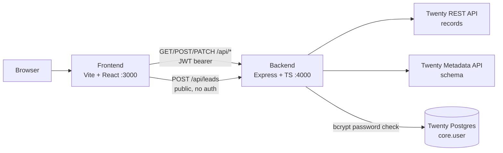
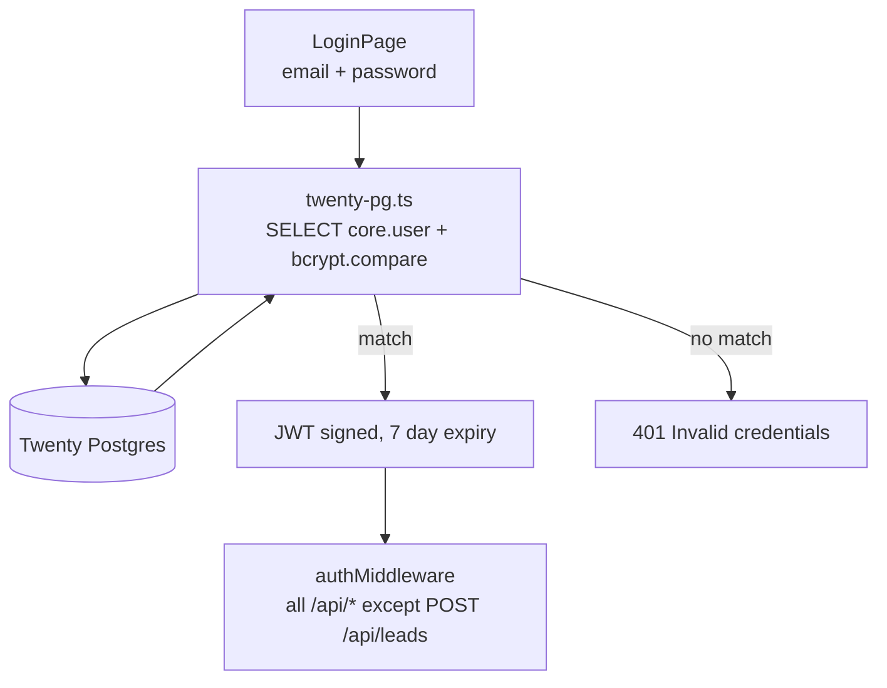
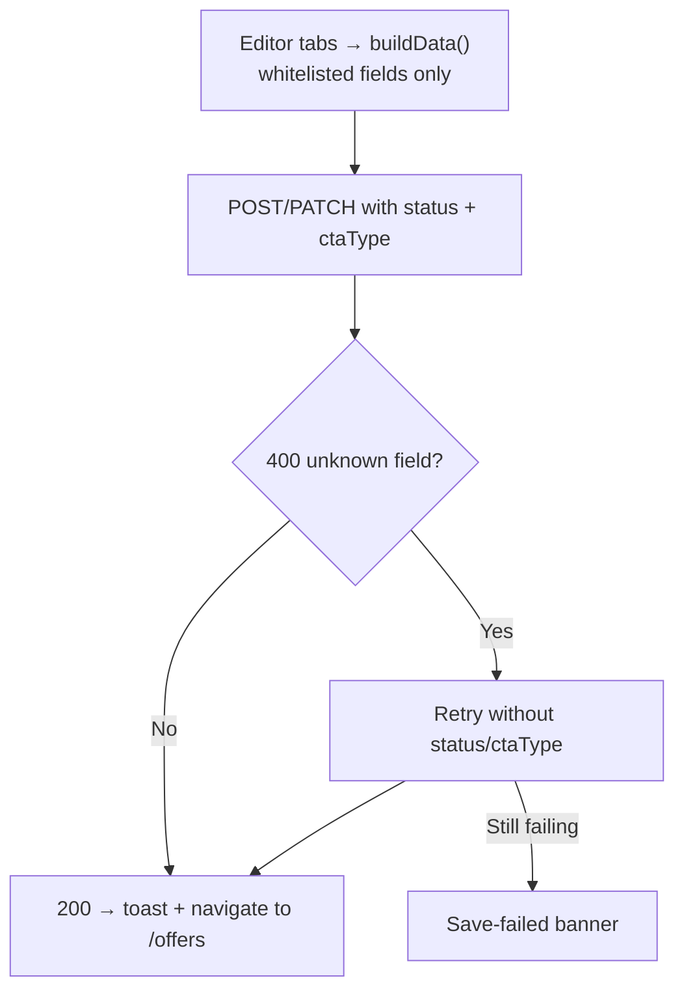
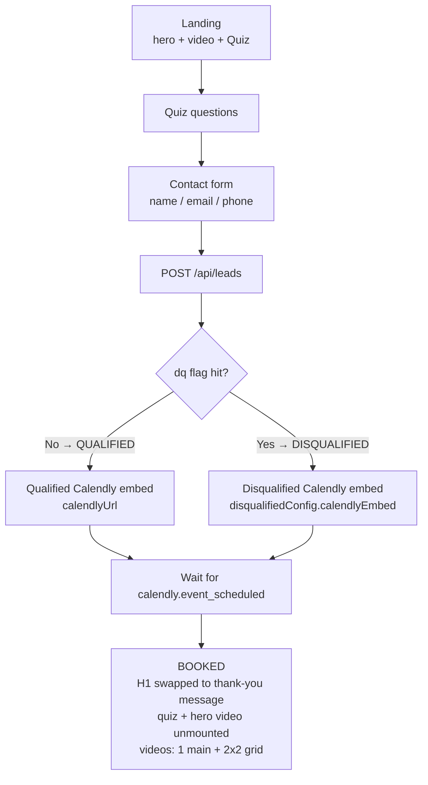

# Open Offer Builder

> 🎥 **Watch the walkthrough:** https://x.com/matthewsoldit/status/2097482754724389058

Hi — I'm **Matthew**, a Sales Engineer. I like contributing and building out
GTM systems that let me do what I want **for free** — and I like sharing what
I make and what I can do. This repo is one of those builds: a complete
offer-funnel system on top of Twenty CRM, open source, no gatekeeping.

If you want me to try and figure out stuff for what *you're* doing — a funnel,
an integration, some gnarly Twenty schema problem — let me know.

---

Offer-funnel builder backed by Twenty CRM. Each offer is a full funnel — landing hero + video + qualifier quiz → contact capture → Calendly booking → booked thank-you with videos — with a disqualified path for poor-fit prospects. Everything is authored in the Offer Detail editor and stored on the `agencyOffers` object in Twenty.

## Architecture

Three processes talk to each other. The browser only ever talks to the
frontend; the frontend talks to the backend over `/api/*`; the backend is the
only thing that touches Twenty (REST for records, Metadata API for schema,
Postgres for login verification).



How it works, end to end:

- **Authoring:** the Offer Detail editor (`OfferDetailPage.tsx`) holds one tab
  per concern (landing, thank-you, disqualified, settings, UTM, proposals).
  Saving whitelists fields and `POST`/`PATCH`es a single `agencyOffers`
  record — configs travel as `RAW_JSON`, embeds/links as `TEXT`/`LINKS`.
- **Serving:** the public preview (`PreviewPage.tsx`) fetches that one record
  and renders hero, video, and quiz from it. No CMS, no build step — editing
  the offer changes the funnel immediately.
- **Capture:** quiz answers + contact form `POST /api/leads` (the one public
  route), creating an `agencyLead` tagged `QUALIFIED`/`DISQUALIFIED`.
- **Booking:** the Calendly widget lives inside `Quiz.tsx`; its
  `event_scheduled` message flips the funnel into the booked state.

Auth follows the same split — the browser never sees Postgres:



Saving is defensive: Twenty rejects unknown fields with a 400, so the editor
tries the full payload first and retries without the not-yet-provisioned
fields (`status`/`ctaType`) rather than failing the whole save:



## How the funnel works



- **Qualified path** uses `thankYouConfig` + `calendlyUrl`.
- **Disqualified path** (any answer with the DQ flag checked — sticky for the session) uses `disqualifiedConfig` + its own Calendly embed. The lead is still captured, tagged `DISQUALIFIED`.
- **Booked state** persists in `localStorage` (`quiz_booking_${offerId}`) so refreshes never resurrect the form; the hero H1 swaps to the branch's Twenty heading.
- **Preview reset** (floating button, preview only): deletes the test `agencyLead` from Twenty, clears the qualification/booking flags, and remounts the quiz. **Simulate booking** fires the same booked state without a real Calendly booking.

## Public surface vs internal preview (one backend, two surfaces)

The same Express backend serves the internal builder and the fast public
funnel — only the frontend route and two unauthenticated endpoints differ:

| Surface | URL | Frontend route | Backend |
|---------|-----|----------------|---------|
| Builder (internal) | `domain.com` or `localhost:3000/offers/:id` (+ `/admin/offers/:id` alias) | `OfferDetailPage` | auth `/api/offers/*` |
| Preview (embedded in Twenty) | `https://offer.domain.com/preview/offers/{{record.id}}` in an iframe | `PreviewPage` (`mode="preview"`) | auth `/api/offers/:id` |
| Public funnel | `https://offer.domain.com/offer` (or `/offer/:slug`) | `PreviewPage` (`mode="public"`) | **no auth** `/api/public/*` |

DNS/hosting: `domain.com` (marketing, isolated), `offer.domain.com` → CNAME
to the builder app, `twenty.domain.com` (self-hosted Twenty). The same
`PreviewPage` renders both preview and public — public mode hides the reset /
simulate pill, the "Preview •" footer, and the Back-to-Offers link, and
`Quiz` posts to `/api/public/leads` instead of `/api/leads`.

Save → preview bridge: the editor broadcasts `offer:saved:<id>` via
`localStorage` + `window.parent.postMessage` on every save; `PreviewPage` in
preview mode listens for both and also re-fetches every 20s (covers the
cross-origin Twenty-iframe case where neither signal can reach it).

```bash
# Visual-only payload (no auth, internal metadata stripped)
curl https://offer.domain.com/api/public/offers/default
curl https://offer.domain.com/api/public/offers/<offer-id>

# Lead capture (no auth) → { "success": true, "leadId": "..." }
curl -X POST https://offer.domain.com/api/public/leads \
  -H 'Content-Type: application/json' \
  -d '{"offerId":"<id>","firstName":"Jane","email":"jane@acme.com",
       "quizAnswers":{"q1":"a1"},"qualificationStatus":"QUALIFIED",
       "sourceUrl":"https://offer.domain.com/offer","utmSource":"meta"}'
```

## Offer Detail editor tabs

`frontend/src/pages/OfferDetailPage.tsx` — top-level tab navigation, each tab edits its own Twenty-backed config:

| Tab | Component | Stored as |
|-----|-----------|-----------|
| Landing page | Basic Info + Hero Section + Video URL + `QualifierQuiz` | `title/name/heroH1/heroLede/videoUrl/quizConfig` |
| Thank-you | `ThankYouEditor` (badge, heading, video, video grid) | `thankYouConfig` (RAW_JSON) |
| Disqualified | `DisqualifiedForm` (same blocks + disqualified Calendly) | `disqualifiedConfig` (RAW_JSON) |
| Settings | `SettingsForm` (Meta Pixel ID, status, CTA type) | `metaPixelId` (TEXT), `status`, `ctaType` |
| UTM swaps | `UtmSwapsForm` (per-UTM text overrides) | `utmSwaps` (RAW_JSON) |
| Proposals | static placeholder | `ProposalsForm.tsx` exists but is not wired into the tab yet |

## Quiz system

- `QualifierQuiz.tsx` — the **editor**: intro headline/description, reusable question blocks (text, type selector, delete), option rows (text, **DQ** toggle, **FB lead-event** toggle, next-question routing, delete), add question/option, contact-info + on-qualified settings. DQ/FB controls have hover tooltips explaining exactly what they do.
- `Quiz.tsx` — the **runtime**: `framer-motion` transitions, progress bar, immediate hover scale, supports `questions` prop (string or `{text, dq, fbLead}` objects).
- Any option with `dq: true` flips the session to disqualified (sticky). Options with `fbLead: true` fire `fbq('track', 'Lead', {content_name, content_category})` when Meta Pixel is configured.
- `nextQuestion` routing is authored but the runtime still advances linearly.

## Colouring, formatting & tokens

Hero copy is authored as raw HTML and rendered verbatim. There is no theme
layer in between — what `RichEditor` saves is what the preview injects.

### 1. Authoring — `RichEditor.tsx` toolbar

Select text, click a style. Each button wraps the selection (`wrapSelection`,
`RichEditor.tsx:11`) and the resulting HTML is stored as-is:

| Button | Title attr | Emitted HTML |
|--------|-----------|--------------|
| **B** | `Bold` | `<strong>…</strong>` |
| **A●** (blue) | `Blue color` | `<span style="color:#2563eb">…</span>` |
| **A●** (dark) | `Dark color` | `<span style="color:#0D2A4C">…</span>` |
| **H** (yellow) | `Highlight (yellow)` | `<mark class="bg-[#FFEB3B] rounded px-0.5">…</mark>` |
| **U** (underlined) | `Underline (for Your Area)` | `<span style="text-decoration:underline; text-decoration-color:#1D5BBF; text-underline-offset:4px; font-weight:700">…</span>` |
| **+ {{area}}** (lede toolbar only) | — | inserts the literal token `{{area}}` at the cursor |

Notes: buttons use `onMouseDown={e => e.preventDefault()}` so the text
selection survives the click (`RichEditor.tsx:77`); the H1 toolbar has no
`{{area}}` button by design (`showAreaToken={false}`); the editor is a
`contentEditable` div syncing `innerHTML` on input/blur (`RichEditor.tsx:54`).

### 2. Storage — verbatim HTML in Twenty

- `heroH1` (`TEXT`) and `heroLede.markdown` (`RICH_TEXT`) hold the editor's
  `innerHTML` unchanged, including tokens (`OfferDetailPage` save payload).
- Styling is **inline `style="…"`**, not classes: Twenty stores raw HTML with
  no access to the app's Tailwind build, so classes would not resolve. The
  one exception is the highlight `<mark class="bg-[#FFEB3B] rounded px-0.5">`,
  which the editor emits but the resolver normalises to inline styles —
  never author `class=` by hand.

### 3. Rendering — `resolveTokens.ts` + `dangerouslySetInnerHTML`

Both `PreviewPage.tsx:233,250` and the builder live preview inject the
resolved HTML unescaped. `resolveAreaTokens(html, { area, keepTokenIfMissing })`
runs three passes in this order (order matters — see gotchas):

1. **Wrapped tokens first**: `{{area}}` already inside an underline `<span>`
   has its inner text replaced; existing `style`/`data-token` attrs are
   stripped and a single clean style applied.
2. **Bare tokens in text nodes only**: HTML is split into tags vs text
   (`out.split(/(<[^>]*>)/)`), so replacements never touch attributes.
   `{{area}}`/`{{city}}` (case-insensitive) → solid underline span with the
   area, or — with no area — a dashed-underline `{{area}}` placeholder
   (`data-token="area"`, no braces, so it can never re-match). `{{name}}`
   is left untouched.
3. **Bare `(like yours)`** → yellow
   `<mark style="background:#FFEB3B; border-radius:2px; padding:0 2px">`,
   skipping text already inside a `<mark>` (depth-tracked).

Token source priority: explicit `?area=` URL param → resolved area → dashed
token placeholder. Tokens are **never** pulled from a prospect record and
never hardcoded to "Your Area".

### Worked example

Stored in Twenty (`heroLede.markdown`):

```html
Acme turns rough inputs into <mark style="background:#FFEB3B; border-radius:2px; padding:0 2px">(like yours)</mark> for other teams in {{area}}.
```

Preview with `?area=Springfield` renders: yellow-highlighted "(like yours)"
plus solid-underlined "Springfield". With no `?area=`, the same string
renders the highlight plus a dashed `{{area}}` token (template mode).

### Gotchas (fixed, documented so they stay fixed)

- **Nested spans**: the bare-token pass must run *after* the wrapped-token
  pass, otherwise `{{area}}` inside an existing underline span gets wrapped
  a second time (`<span><span>`).
- **Leaked `style="…"` as visible text**: caused by matching `{{area}}`
  inside `data-token="{{area}}"` attributes. Fixed by tag/text splitting
  and brace-free `data-token="area"`.

## Tracking

- Per-offer `metaPixelId` (Settings tab → Twenty `TEXT` field). Preview injects the Meta Pixel base code (`fbq('init')` + `PageView`); quiz answers flagged FB-lead fire `Lead` events.
- Test an event from Settings with **Test Lead event →** (logs to console when `fbq` is present).

## Tech stack

- **Backend:** Node.js + Express + TypeScript, Twenty REST + Metadata APIs, Postgres (`core."user"`) password verification, JWT auth.
- **Frontend:** React 18 + TypeScript + Vite, Tailwind CSS, TanStack Query, `@floating-ui/react` (all dropdowns/tooltips — no native `<select>`), `framer-motion`, Satoshi font, `--ods-*` design tokens.

## Directory structure

```
open-offer-builder/
├── backend/src/
│   ├── routes/
│   │   ├── auth.ts        # login via Twenty Postgres, JWT issue
│   │   ├── offers.ts      # agencyOffers CRUD (POST/PATCH whitelist)
│   │   ├── leads.ts       # POST /api/leads (public funnel), DELETE /:id (preview reset)
│   │   └── prospects.ts   # normalized prospect/lead list (city/region included)
│   ├── lib/
│   │   ├── twenty-client.ts  # Twenty REST wrapper
│   │   └── logger.ts         # timestamped [http]/[auth]/[offers] logs
│   ├── db/twenty-pg.ts       # read-only Twenty Postgres pool + bcrypt verify
│   ├── middleware/auth.ts    # JWT middleware (throws without JWT_SECRET in prod)
│   └── scripts/
│       ├── seed.ts            # ensure agencyOffers object + all fields (start here)
│       └── ensure-*.ts        # idempotent single-field bootstrap
│           (quiz, thankyou, disqualified, calendly, pixel, utm, lead/prospect qual, status/cta)
├── frontend/src/
│   ├── pages/
│   │   ├── LoginPage.tsx       # TropicalTideBackground + Twenty credential login
│   │   ├── OffersPage.tsx      # offers table (status/CTA inline selects, delete modal)
│   │   ├── OfferDetailPage.tsx # 6-tab editor + save with retry
│   │   └── PreviewPage.tsx     # public funnel (/preview/:industryId/:id)
│   ├── components/
│   │   ├── Quiz.tsx / QualifierQuiz.tsx
│   │   ├── ThankYouEditor.tsx / DisqualifiedForm.tsx
│   │   ├── SettingsForm.tsx / UtmSwapsForm.tsx / ProposalsForm.tsx
│   │   ├── ProspectSelect.tsx / StatusSelect.tsx / RichEditor.tsx
│   │   └── ui/ (Modal, Button, Badge, Toast, Spinner/Spokes, WidgetCard)
│   └── lib/
│       ├── api.ts / resolveTokens.ts / twentyOptions.ts / utils.ts
└── package.json  # bun workspaces (backend + frontend)
```

## Twenty CRM integration

### Creating objects with Twenty (REST vs Metadata API)

Two different APIs do two different jobs — mixing them up is the most common
source of `404`/`400` errors in this project:

- **Metadata API** (`POST https://<twenty>/metadata`, GraphQL) — defines
  **schema**: custom *objects* and *fields*. This is how `agencyOffers` itself
  (and every custom field on it) comes into existence.
- **REST API** (`https://<twenty>/rest/...`, `Authorization: Bearer
  <TWENTY_API_KEY>`) — reads/writes **records** on objects that already exist:
  `GET /agencyOffers?limit=N`, `POST /agencyOffers`, `PATCH
  /agencyOffers/:id`, `GET /agencyOffers/:id`, `DELETE /agencyOffers/:id`.

So creating the `agencyOffers` object looks like this (Metadata API):

```graphql
mutation CreateOneObjectMetadataItem($input: CreateOneObjectInput!) {
  createOneObject(input: $input) { id nameSingular namePlural }
}
```

```json
{ "input": { "object": {
  "nameSingular": "agencyOffer",
  "namePlural": "agencyOffers",
  "labelSingular": "Agency Offer",
  "labelPlural": "Agency Offers",
  "description": "Offer funnels built by open-offer-builder"
} } }
```

Custom fields are added the same way (`createOneField` with
`objectMetadataId` + `name`/`label`/`type`/`description`, plus `options` for
`SELECT`). Two rules Twenty enforces that have bitten us before:

- `SELECT` option `value`s **must** be UPPER_CASE (`DRAFT`, not `draft`).
- Field creation needs the object's metadata `id`, so scripts always
  list-then-find `agencyOffer` first.

### Seed command (idempotent)

`bun run --cwd backend seed` (`backend/src/scripts/seed.ts`) ensures the
whole thing exists in one go: it creates the `agencyOffers` object **only if
missing**, then creates each missing custom field (`quizConfig`,
`thankYouConfig`, `disqualifiedConfig`, `utmSwaps`, `calendlyUrl`,
`metaPixelId`, `status`, `ctaType`). Anything already present is skipped, so
re-running is safe:

```
✓ agencyOffers object already exists (43f10e00-…)
✓ field quizConfig already exists — skipping
✓ seed done — agencyOffers ready
```

Run this first on any fresh Twenty workspace, then create records via
`POST /rest/agencyOffers` (or the Offer Detail editor, which does the same
through the backend).

### agencyOffers fields

| Field | Type | Notes |
|-------|------|-------|
| title / name | TEXT | `name` doubles as `prospectId` lookup (`filter=name[eq]:id`) |
| heroH1 | TEXT | raw HTML from RichEditor, rendered verbatim |
| heroLede | RICH_TEXT | `{markdown, blocknote}` — markdown holds HTML + `{{area}}` |
| videoUrl | LINKS | `{primaryLinkLabel, primaryLinkUrl, secondaryLinks[]}` |
| status | SELECT | `DRAFT`/`ACTIVE`/`PAUSED` (UPPER_CASE required) |
| ctaType | SELECT | `CONSULTATION`/`PRICING`/`CUSTOM` (UPPER_CASE required; currently stored only — the funnel always ends in booking) |
| quizConfig | RAW_JSON | `QuizQuestion[]` with `dq`/`fbLead`/`nextQuestion` per option |
| thankYouConfig | RAW_JSON | badge, heading, `video` URL, video grid |
| disqualifiedConfig | RAW_JSON | same + `calendlyEmbed` (full inline widget HTML) |
| calendlyUrl | TEXT | qualified Calendly embed HTML (or bare URL) |
| metaPixelId | TEXT | per-offer Meta Pixel ID, empty = disabled |
| utmSwaps | RAW_JSON | `{default, rules[]}` per-UTM text overrides |

`status`/`ctaType` option values **must** be UPPER_CASE (Twenty validates). The UI keeps pretty labels and uppercases on write.

### agencyLeads fields (funnel-created)

| Field | Type | Notes |
|-------|------|-------|
| qualificationStatus | SELECT | `QUALIFIED` (green) / `DISQUALIFIED` (red) |
| status | SELECT | mirrors qualification (`QUALIFIED` → `QUALIFIED`, `DISQUALIFIED` → `LOST`) |
| note | TEXT | contact details + quiz answers JSON (EMAILS type is finicky, so contact lives in `note`) |

### Backend API

- `POST /api/auth/login`, `GET /api/auth/me`
- `GET /api/offers`, `GET /api/offers/:id`, `POST /api/offers`, `PATCH /api/offers/:id`, `DELETE /api/offers/:id` (auth required; save retries without `status`/`ctaType` if Twenty lacks the fields)
- `POST /api/leads` (**public** — funnel submissions), `GET /api/leads`, `DELETE /api/leads/:id` (preview reset)
- `GET /api/public/offers/:slug` (**public** — visual-only payload; `:slug` is an offer id, slugified title/name, or `default` = first ACTIVE offer), `POST /api/public/leads` (**public** — funnel capture, returns `{ success, leadId }`)
- `GET /api/prospects` — normalized prospects/leads for the picker
- `GET /api/health`

## Quick start

Requirements: Node.js ≥ 18, bun, a Twenty CRM instance.

```bash
cp .env.example .env.local   # fill in TWENTY_BASE_URL, TWENTY_API_KEY, TWENTY_DATABASE_URL, JWT_SECRET
bun install
bun run dev                  # backend :4000 + frontend :3000, raw interleaved logs
```

- Frontend: http://localhost:3000 (login with Twenty credentials → `/login` → `/offers`)
- Preview: http://localhost:3000/preview/general/:id (`?area=Springfield` resolves `{{area}}`)
- Health: http://localhost:4000/api/health

Create missing Twenty fields (idempotent) — prefer the seed command, which
covers the object plus every field in one run:

```bash
bun run --cwd backend seed
# …or individual scripts: src/scripts/ensure-quiz-field.ts,
#   ensure-thankyou-field, ensure-disqualified-field, ensure-calendly-field,
#   ensure-pixel-field, ensure-utm-field, ensure-lead-field,
#   ensure-prospect-qual, ensure-status-cta-fields
```

Build: `bun run --cwd frontend build` (`tsc` is clean — zero errors).

## Environment

`.env.local` (never committed):

```
TWENTY_BASE_URL=https://twenty.inferencesaver.com   # no /rest suffix
TWENTY_API_KEY=...
TWENTY_DATABASE_URL=postgres://...                  # read-only Twenty Postgres for login
PORT=4000
JWT_SECRET=...                                      # required in prod — no fallback
VITE_API_URL=http://localhost:4000
```

## Conventions

- No native `<select>` — all dropdowns use `@floating-ui/react` + `FloatingPortal` (see `StatusSelect`, `ProspectSelect`, `QualifierQuiz` selects).
- No backend internals in prospect-facing copy (no QUALIFIED/DISQUALIFIED badges, no `agencyLead`/Twenty mentions in `Quiz`).
- Loading states always use the `Spokes` spinner, never "Loading..." text.
- `console.log('[OfferDetail] …')` / `[Quiz] …` / `[Preview] …` JSON logs in dev; `[http]` request logs on the backend.

## License

MIT

---

## Work with me

I'm Matthew, a Sales Engineer who builds GTM systems in the open — free
tooling, shared playbooks, no black boxes. Everything in this repo is how I
actually do it.

🎥 Walkthrough: https://x.com/matthewsoldit/status/2097482754724389058

Got something you're stuck on — a funnel that won't convert, a CRM schema
that fights back, some integration nobody has documented? Reach out and I'll
try to figure it out with you.
